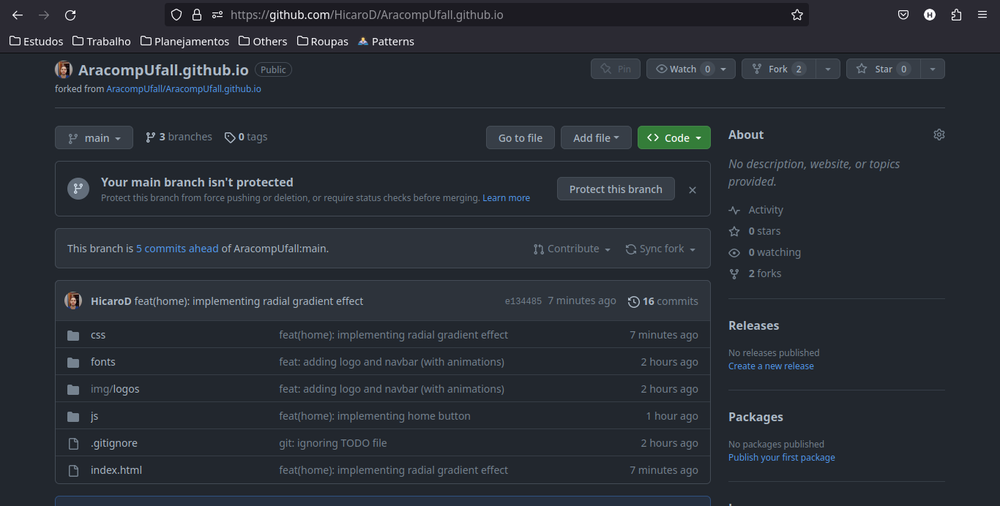
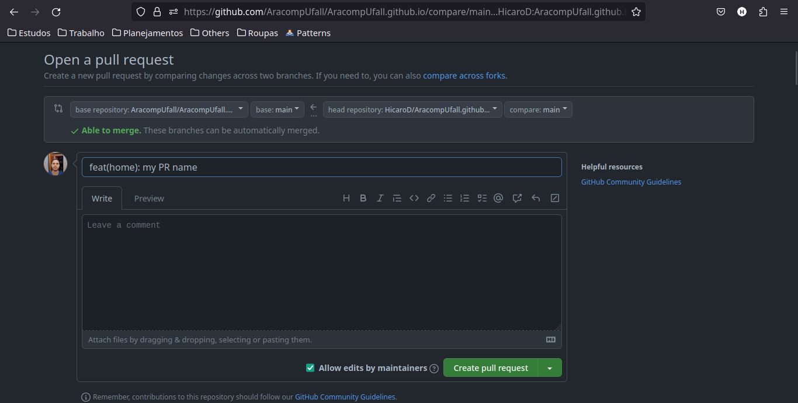

# Aracomp UFAL

Landing page para o Aracomp UFAL 2023.

## Guia de contribuição

1. Faça um fork do repositório original.

2. Agora clone o repositório em sua máquina

```bash
git clone https://github.com/{SEU_USERNAME_DO_GITHUB_AQUI}/AracompUfall.github.io
```

Substitua `{SEU_USERNAME_DO_GITHUB_AQUI}` pelo seu username do GitHub.

3. Crie uma branch para poder contribuir

```bash
git checkout -b feature/home-page
```

4. Faça o push das alterações em sue fork com o seguinte comando após fazer as alterações necessárias:

```bash
git push origin main
```

5. Agora, acesse o fork em seu GitHub e você verá algo semelhante a isso abaixo:



Clique em "Contribute", que está localizada um pouco abaixo do botão "Protect
this branch", e abra um pull request para poder colocar suas mudanças no repositório
original.

6. Agora, dê um nome para sua PR e clique em "Create pull request":



7. Agora, aguarde sua PR ser aceita pelo dono do repositório
